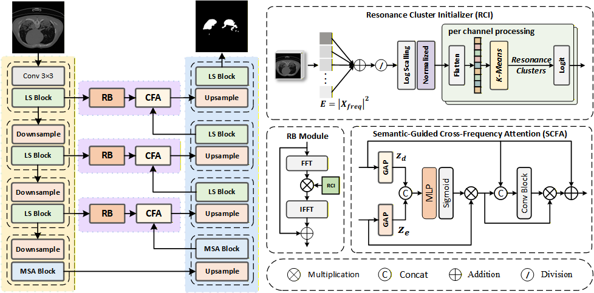

<h2 align="center">✨FSR-Net: Frequency-Selective Resonance Learning for Medical Image Segmentation Segmentation</h2>


<!-- <p align="center">
  <b>Mengqi Lei<sup>1</sup>, Haochen Wu<sup>1</sup>, Xinhua Lv<sup>1</sup>, Xin Wang<sup>2</sup></b>
</p>

<p align="center">
  <sup>1</sup>China University of Geosciences, Wuhan 430074, China<br>
  <sup>2</sup>Baidu Inc, Beijing, China<br>
</p> -->

  <p align="center"> 
  <!-- Contact Badge -->
  <a href="107552404008@stu.xju.edu.cn" target="_blank">
      
  </a>
</p>


## Overview🔍
<div>
    
</div>

**Figure 1. The framework of the proposed FSR-Net.**


**_Abstract -_** With the widespread application of frequency domain learning in computer vision, frequency-domain-based models have shown significant potential in medical image segmentation. However, existing methods suffer from two key limitations: First, frequency domain filters often rely on fixed or random initialization, which ignores the significant inter-domain spectral discrepancy. This domain-agnostic initialization fails to capture the unique frequency characteristics of specific datasets, making it difficult to separate lesions from noise in diverse imaging scenarios. Second, the absence of high-level semantic guidance leads to semantic-spectrum misalignment, which inevitably results in multi-scale feature inconsistency. To address these challenges, this paper proposes a novel framework called FSR-Net, which incorporates an initialization strategy based on frequency domain statistical priors. By performing K-means clustering on the Fourier spectra of training samples, this strategy mines domain-specific spectral bases, providing an anatomically informed initialization that effectively facilitates the separation of low-contrast lesions from noise. Furthermore, we propose a Semantically Guided Cross-Frequency Attention (SCFA) module. The SCFA module synchronizes the encoder's frequency selection with the decoder’s high-level semantics, dynamically recalibrating frequency bands to ensure that spectral enhancement is spatially and semantically aligned with specific anatomical targets. Extensive experiments on four benchmark datasets demonstrate that FSR-Net outperforms state-of-the-art methods, achieving mIoU improvements of 0.75\%, 0.75\%, 1.02\%, and 1.06\% respectively. 
## Datasets📚
To verify the performance and general applicability of our FSR-Net in the field of medical image segmentation, we conducted experiments on four challenging public datasets: ISIC-2018, Kvasir, COVID-19, and Moun-Seg, covering subdivision tasks across four modalities. 

| Dataset      | Modality                  | Anatomic Region | Segmentation Target |
|--------------|---------------------------|-----------------|---------------------|
| ISIC-2018    | dermoscope                | skin            | malignant skin lesion |
| Kvasir       | endoscope                 | colon           | polyp               |
| COVID-19     | CT (Computed Tomography)  | Lungs           | lung infection regions |
| MoNuSeg      | histopathology            | Multiple organs | Nuclei              |


To ensure fair comparison, all competing models (including the proposed LSDF-UNet and the baseline models) followed the same training setup: the AdamW optimizer was used with the CosineAnnealingLR dynamic learning rate scheduling strategy, the input image was uniformly resized to 256×256 resolution, and data augmentation was performed through horizontal/vertical flipping and random rotations. The training cycle is 200 epochs, the initial learning rate is 1e-3, and the batch size is fixed to 8.


## Getting Started🚀
### 1. Install Environment

```
conda create -n FSR-Net python=3.10
conda activate FSR-Net
pip3 install torch torchvision torchaudio --index-url https://download.pytorch.org/whl/cu118
pip install packaging
pip install timm
pip install pytest chardet yacs termcolor
pip install submitit tensorboardX
pip install triton
pip install scikit-learn matplotlib thop h5py SimpleITK scikit-image medpy yacs PyWavelets
```

### 2. Prepare Datasets

- Download datasets: ISIC2018 from this [link](https://challenge.isic-archive.com/data/#2018), Kvasir from this[link](https://link.zhihu.com/?target=https%3A//datasets.simula.no/downloads/kvasir-seg.zip), COVID-19 from this [link](https://drive.usercontent.google.com/download?id=1FHx0Cqkq9iYjEMN3Ldm9FnZ4Vr1u3p-j&export=download&authuser=0), and Moun-Seg from this [link](https://www.kaggle.com/datasets/tuanledinh/monuseg2018).


- Folder organization: put datasets into ./data/datasets folder.

### 3. Train the FSR-Net

```
python train.py --datasets ISIC2018
training records is saved to ./log folder
pre-training file is saved to ./checkpoints/ISIC2018/best.pth
concrete information see train.py, please
```

### 3. Test the FSR-Net

```
python test.py --datasets ISIC2018
testing records is saved to ./log folder
testing results are saved to ./Test/ISIC2018/images folder
concrete information see test.py, please
```

## License📜
The source code is free for research and education use only. Any comercial use should get formal permission first.


